# first_project

## A python with API project to analyze the availability of preferred amenities in three NYC boroughs to determine which borough may be the best choice to facilitate 500 professionals for a 2-year period. 

### Table of Contents
#### Introduction
#### Requirements & Dependencies
#### Analysis and Results
#### Usage
#### Contributing
#### License

### Introduction
This project uses two Jupyter Notebook (ipynb) scripts with python and appropriate software components, as well as Application Programming Interface (API) to gather weather data about preferred amenities in NYC, in order to recommend the borough that best meets speciified criteria. The project includes making API calls, creating DataFrames, computing and analyzing summary totals, creating interactive maps, and saving visualizations as outputs in a designated folder.

The project includes code features for protecting API keys.

Requirements & Dependencies
Developers are highly encouraged to set up a virtual environment to ensure proper management of dependencies.
You will need the following software components:

Python (version 3.10.9)
Pandas (version 2.0.3)
Matplotlib (version 3.7.1)
geoviews
geoviews.tile_sources  
hvplot.pandas
json
numpy
requests
os
shutil

## Analysis

- A separate script 'Api_requests.pynb' was used to make two Yelp API calls with JSON to handle and export lounge and grocery datasets as csv files to a folder named 'Resources'. Another script was used to fetch the data for electric vehicle (EV) charging stations using a CSV URL and code to also export the file to the 'Resources' folder. 

- Pandas was used to read the three csv files and create respective dataframes. 

- The EVCS dataframe was wrangled to keep only specified columns, rename columns, and then add a column 'Type' to indicate the amenity-EVCS.

#### EVCS DF Output
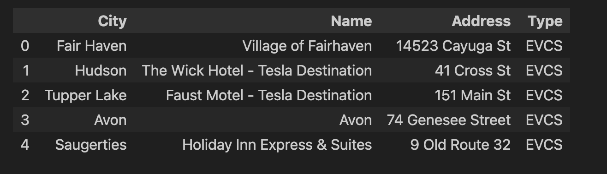
 
 
 
 
 

---
- The lounge dataframe added a column 'Type' to indicate the amenity-Lounge.

#### Lounge DF Output
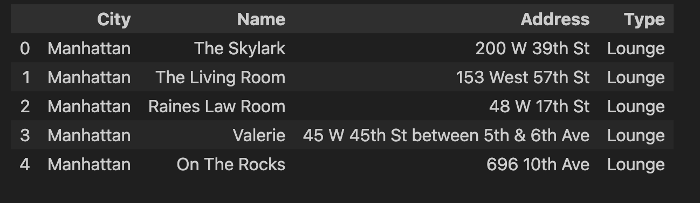
 
 
 
 
 

---
- The grocery dataframe added a column 'Type' to indicate the amenity-Grocery.

#### Grocery DF Output
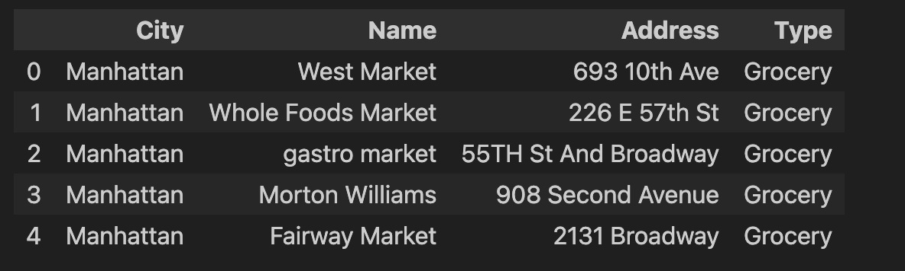
 
 
 
 
 

---
- The three dataframes were concatenated with pandas to create a stacked dataframe, and also check the dataframes features. 

#### Stacked DF Info and Head
 
 
 
 
 
 

---
- The stacked dataframe was cleaned by dropping null/empty and duplicate values. The length of the dataframe was also checked.

#### Clean Stacked DF Length 
 
 
 
 
 
 

---
- A specific city dataframe was created from the clean stacked dataframe to return only rows for the three preferred boroughs. The length of the specific cities dataframe was checked as well as the unique cities. 

#### Specific City DF Length and Unique Cities
 
 
 
 
 
 
 

---

- The EV charging stations were counted by borough and a bar graph was made to visualize the results.

#### EVCS Counts and Bar Graph
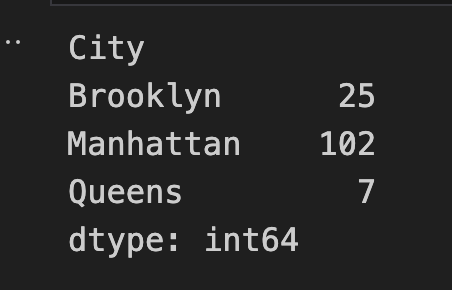 
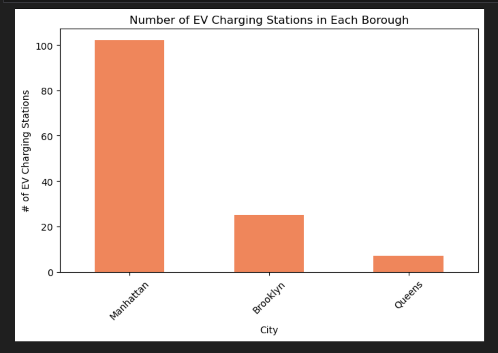 
 
 
 
 
 

---

- The lounges were counted by borough and a bar graph was made to visualize the results.

#### Lounge Counts and Bar Graph
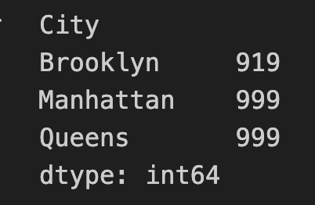 
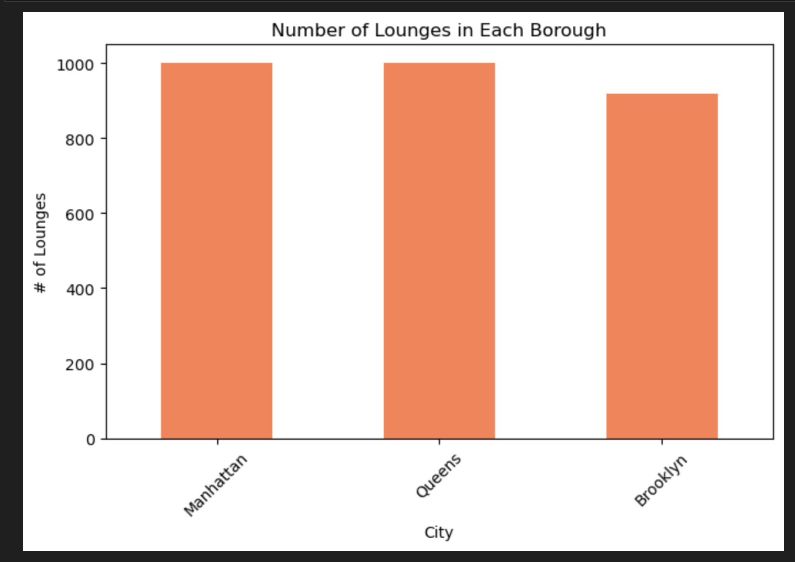 
 
 
 
 
 

---

- A check was made to find out the top 10 grocery stores by count.
#### Top 10 Grocery 
 
 
 
 

---
- The top 10 grocery stores were counted by borough and a bar graph was made to visualize the results.
#### Top 10 Grocers, Counts, and Bar Graph
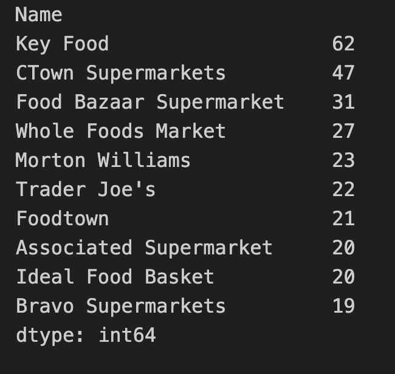 
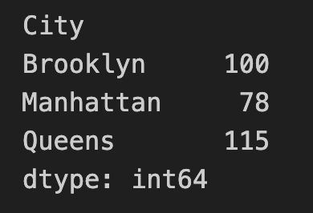 
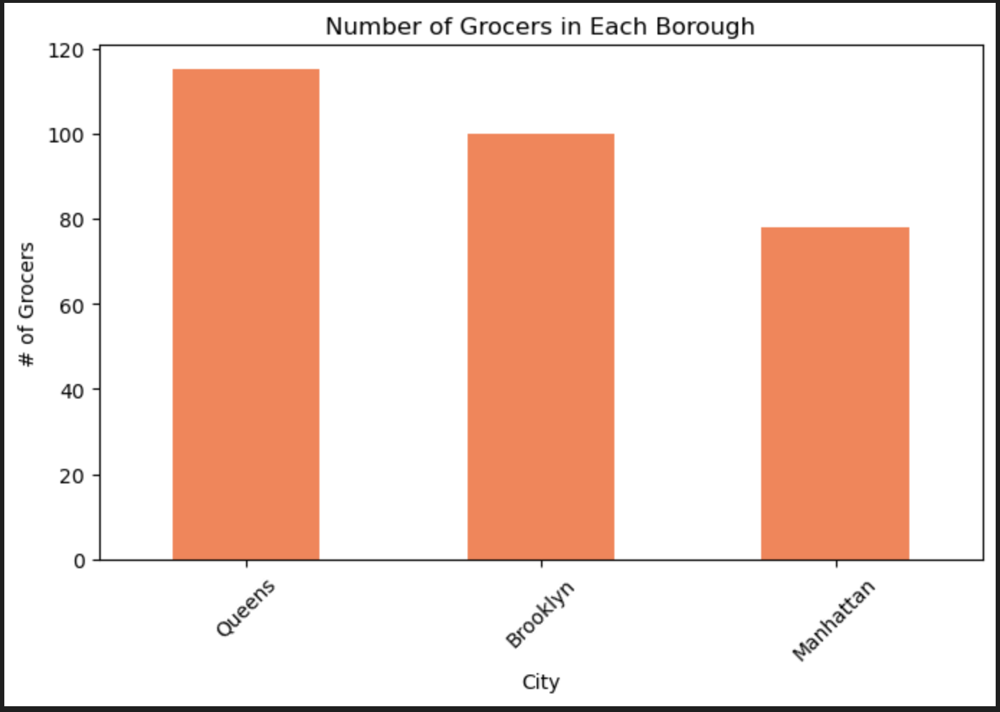 
 
 
 
 
 

---
- The counts of combined amenities for each borough was calculated, as well as the borough with most combined counts of all three amenities.
#### Top Borough Statement
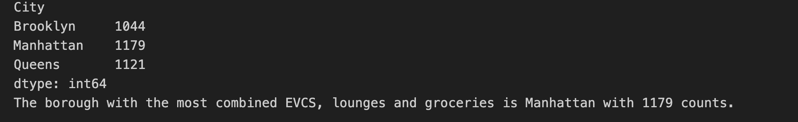 
 
 
 
 
 

---
- A map was made to show the boroughs with colored circles to represent the size of their combined amenities available. 
#### Map
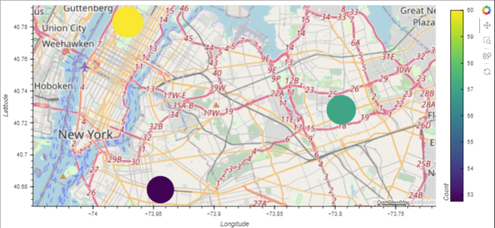 
 
 
 
 
 

---
### Usage
Here's how to use the Jupyter Notebook NYCamenitiesPy and API_requests scripts:

- ##### Create a pyhton script to store and import API keys as aliases. 

- ##### Distribute code appropriately across Jupiter Notebook cells to display the desired output.

- ##### Run the code.
- The scripts will make API calls, organize and analyze data to display the specified elements in-line 

### Contributing

Contributions to this project are highly encouraged! If you wish to contribute, please follow these guidelines:

- Fork the respective repository for the Pymaceuticals Jupyter Notebook script and clone it locally.
- Create a new branch for your feature or bug fix.
- Commit your changes with descriptive commit messages.
- Push your branch to your forked repository.
- Submit a pull request to the original repository.
- Please ensure that your code adheres to the project's coding style and conventions.

If you encounter any issues or have suggestions for improvements, please open an issue on the GitHub repository.

### License
This project is licensed under the MIT License. Feel free to use, modify, and distribute the code as per the terms of the license. 